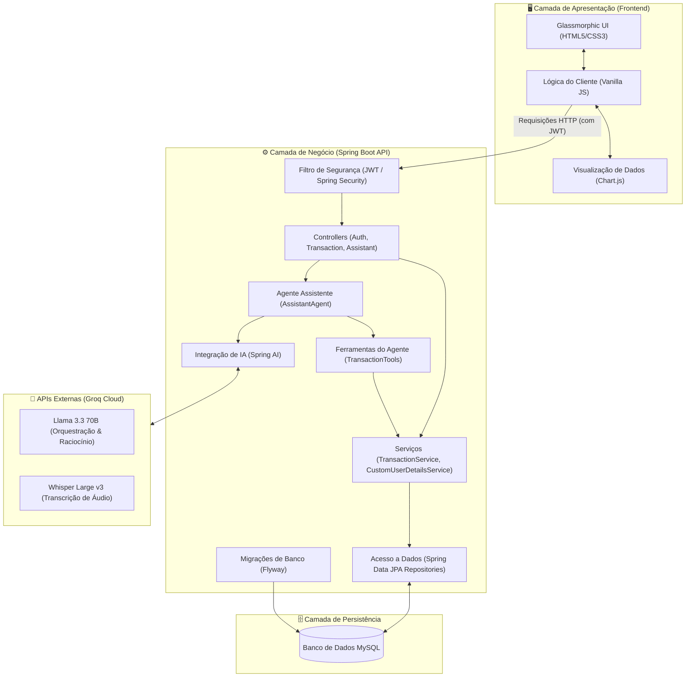
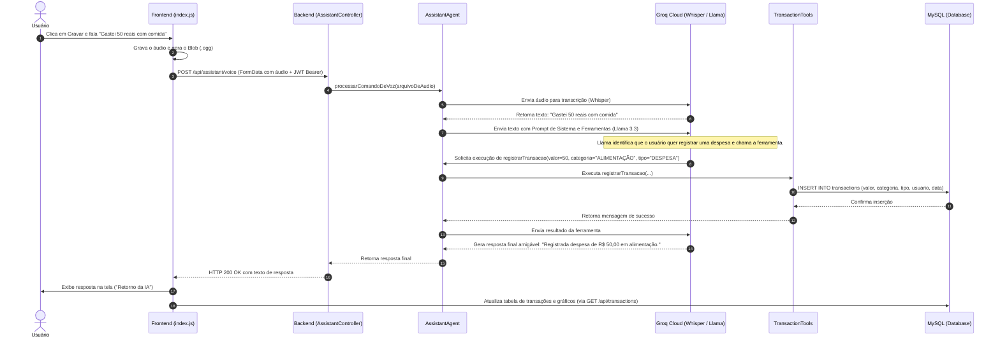
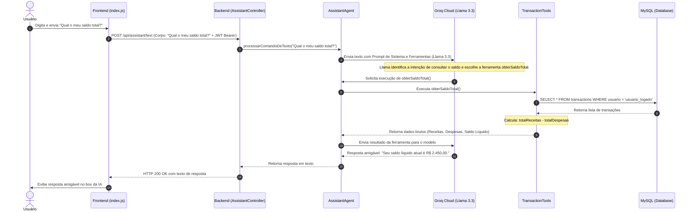

# 💰 Gerenciador de Orçamento Inteligente com IA Generativa (Spring AI + Groq)

Este é um projeto de controle de orçamento inteligente construído em **Spring Boot 4.1.0**, **Java 25**, **MySQL** e integrado com **Spring AI**. Ele utiliza modelos de Inteligência Artificial Generativa hospedados na **Groq** para transcrição de áudio (usando Whisper) e orquestração de comandos financeiros (usando Llama 3.3 com Function Calling).

A aplicação conta com um painel web interativo (*Glassmorphic UI*), suporte a modo claro/escuro, controle de autenticação via JWT, banco de dados MySQL automatizado com Flyway e testes automatizados com Mockito.

---

## 🛠️ Tecnologias Utilizadas

*   **Backend:** Java 25, Spring Boot 4.1.0, Spring Security (JWT), Spring Data JPA, Spring AI.
*   **Orquestração de IA:** Groq API (Modelos: `llama-3.3-70b-versatile` para processamento e `whisper-large-v3` para transcrição de áudio).
*   **Banco de Dados:** MySQL com controle de migrações automáticas via Flyway.
*   **Frontend:** HTML5, CSS3 (Glassmorphism design, CSS Variables para temas), Vanilla JavaScript (Audio Recording API, Chart.js para visualização).
*   **Documentação:** Springdoc OpenAPI (Swagger UI).

---

## 🏗️ Arquitetura do Sistema e Fluxo de Dados

Abaixo estão detalhados a estrutura de componentes do sistema e os fluxos de execução das ações inteligentes orientadas por IA Generativa.

### 1. Diagrama de Arquitetura do Sistema
O sistema segue uma arquitetura em camadas bem delimitadas, onde o **Frontend** se comunica de forma assíncrona com o **Backend** exposto por APIs Rest protegidas por segurança baseada em JWT. O backend interage com o **Banco de Dados MySQL** e delega tarefas de inteligência cognitiva à **Groq Cloud API** através do **Spring AI**.



### 2. Fluxo de Dados: Processamento de Comando de Voz
Este fluxo ilustra o caminho percorrido desde o momento em que o usuário grava um comando de áudio até o registro físico da transação correspondente no banco de dados.



### 3. Fluxo de Dados: Consulta Inteligente por Texto
Este fluxo demonstra como as perguntas analíticas enviadas por texto (como consultas de saldo ou relatórios) são resolvidas dinamicamente via LLM a partir de ferramentas integradas ao banco.



---

## 🚀 Guia Passo a Passo: Configuração e Execução

Siga os passos abaixo para configurar e executar a aplicação em seu ambiente local:

### 1. Pré-requisitos
Certifique-se de ter instalado em sua máquina:
*   **Java 25** ou superior.
*   **MySQL Server** (rodando localmente ou em contêiner).

### 2. Configuração do Banco de Dados
O banco de dados configurado por padrão é o MySQL com o esquema `budget_ia_db`.
1.  Certifique-se de que o servidor MySQL está rodando na porta `3306`.
2.  A string de conexão já possui a diretiva `createDatabaseIfNotExist=true` em [application.properties](file:///D:/Dev/projeto_copiloto/budgeting_2026/src/main/resources/application.properties), o que criará o banco automaticamente se o usuário tiver as devidas permissões.
3.  Caso suas credenciais locais do MySQL sejam diferentes do padrão (`root` / `mf459@`), configure as suas variáveis de ambiente ou altere-as diretamente em [application.properties](file:///D:/Dev/projeto_copiloto/budgeting_2026/src/main/resources/application.properties):
    ```properties
    spring.datasource.username=seu_usuario
    spring.datasource.password=sua_senha
    ```

### 3. Configuração da API Key da Groq
Este projeto utiliza a API da Groq para processar os modelos de linguagem e transcrição de voz.
1.  Obtenha uma chave de API na plataforma da [Groq Console](https://console.groq.com/).
2.  Insira sua chave no arquivo [application-local.properties](file:///D:/Dev/projeto_copiloto/budgeting_2026/src/main/resources/application-local.properties):
    ```properties
    spring.ai.openai.api-key=SUA_CHAVE_AQUI
    ```
    *(Nota: O projeto também suporta ler essa chave a partir de um arquivo `.env` na raiz por meio do dotenv).*

### 4. Executando a Aplicação
Abra o diretório raiz do projeto e execute o comando abaixo para compilar e iniciar o servidor Spring Boot:
*   **No Windows (PowerShell):**
    ```powershell
    .\gradlew.bat bootRun
    ```
*   **No Linux / macOS:**
    ```bash
    ./gradlew bootRun
    ```
O servidor iniciará por padrão na porta `8080`.

---

## 🖥️ Como Utilizar a Aplicação

### 1. Painel Web (Interface Gráfica Premium)
Acesse a aplicação diretamente no seu navegador:
👉 **[http://localhost:8080/](http://localhost:8080/)**

**Recursos do Painel Web:**
*   **Autenticação Obrigatória:** O painel exige login ou cadastro para acessar os recursos.
*   **Alternador de Tema (Light/Dark Mode):** Clique no ícone de Sol/Lua no topo do cabeçalho para alternar entre o tema claro e o tema escuro. O tema selecionado é salvo no seu navegador.
*   **Assistente de Voz:** Clique no botão do microfone, grave um comando como *"Gastei 50 reais com alimentação"* e pare a gravação. A IA fará a transcrição e registrará a transação em tempo real.
*   **Gráficos Visuais (Chart.js):** Gráficos interativos mostram a distribuição de despesas por categoria e o comparativo geral de receitas vs despesas.
*   **Lista de Transações:** Exibe, edita e remove transações cadastradas.
*   **Botão Sair (Logout):** Limpa o token armazenado e retorna com segurança para a tela de autenticação.

### 2. Interface de Teste da API (Swagger UI)
Acesse o painel interativo do Swagger para testar os endpoints:
👉 **[http://localhost:8080/swagger-ui.html](http://localhost:8080/swagger-ui.html)**

---

## 🔒 Segurança e Guia de Autenticação (JWT)

A API possui endpoints públicos e privados configurados em [SecurityConfig.java](file:///D:/Dev/projeto_copiloto/budgeting_2026/src/main/java/br/com/budgeting/config/SecurityConfig.java). As operações do assistente e a manipulação direta de transações exigem um token JWT válido.

### Passo 1: Criar uma conta
No Swagger UI ou via cliente HTTP, envie uma requisição `POST` para `/api/auth/register` (público):
```json
{
  "username": "seu_usuario",
  "password": "sua_senha"
}
```

### Passo 2: Obter o Token JWT (Login)
Envie uma requisição `POST` para `/api/auth/login` (público):
```json
{
  "username": "seu_usuario",
  "password": "sua_senha"
}
```
A resposta conterá um token de acesso:
```json
{
  "token": "eyJhbGciOiJIUzI1NiIsInR5c...",
  "username": "seu_usuario"
}
```

### Passo 3: Autorizar requisições no Swagger UI
1.  Clique no botão **Authorize** (ícone de cadeado verde) localizado no topo superior direito da página do Swagger UI.
2.  Insira o token obtido no campo de texto e clique em **Authorize**.
    > [!TIP]
    > O filtro de segurança [JwtAuthenticationFilter.java](file:///D:/Dev/projeto_copiloto/budgeting_2026/src/main/java/br/com/budgeting/security/JwtAuthenticationFilter.java) é robusto: ele aceita tanto o token bruto quanto o token contendo o prefixo `Bearer ` redundante colado acidentalmente.
3.  Feche o modal. Os endpoints protegidos agora exibirão o cadeado fechado e funcionarão sem retornar erro 403.

---

## 🎙️ Como Testar o Assistente de IA

Os endpoints `/api/assistant/text` e `/api/assistant/voice` interpretam comandos por voz ou texto e criam automaticamente as transações no banco, associando-as ao usuário autenticado.

### Exemplo de Comandos Aceitos:
*   *"Registrar despesa de 50 reais em alimentação"*
*   *"Recebi um salário de 3000 reais na categoria renda"*
*   *"Registrar despesa de 120 reais em transporte"*

### Enviando Comandos via `curl` (Autenticado):

*   **Comando de Texto:**
    ```bash
    curl -X 'POST' \
      'http://localhost:8080/api/assistant/text' \
      -H 'Authorization: Bearer <COLE_SEU_TOKEN_AQUI>' \
      -H 'Content-Type: text/plain' \
      -d 'Registrar despesa de 50 reais em alimentação'
    ```

*   **Comando de Áudio (Arquivo de Voz):**
    ```bash
    curl -X 'POST' \
      'http://localhost:8080/api/assistant/voice' \
      -H 'Authorization: Bearer <COLE_SEU_TOKEN_AQUI>' \
      -H 'Content-Type: multipart/form-data' \
      -F 'audio=@caminho/para/seu/arquivo.ogg'
    ```

---

## 📋 Diagnósticos e Logs do Sistema no Terminal

A aplicação imprime logs úteis diretamente no terminal para auxiliar no desenvolvimento e monitoramento de falhas:

*   **Mensagens de Sucesso:** Quando o assistente conclui o processamento com sucesso, o terminal registra:
    *   `Operação concluída com sucesso: Comando de voz processado.`
    *   `Operação concluída com sucesso: Comando de texto processado.`
*   **Problemas de Autenticação (JWT):** Se uma requisição falhar com erro 403, o terminal informará o motivo exato:
    *   `Token JWT expirado! Detalhes: JWT expired at <data>`
    *   `Assinatura do Token JWT inválida! Detalhes: <motivo>`
*   **Segurança de Sessão Expira / Logout:** No painel frontend, se o token expirar ou se tornar inválido, a aplicação detecta os retornos 401 e 403 das APIs, realiza o logout automaticamente e exibe a tela de login.

---

## 🤖 Extensões Assistidas por IA (Melhorias)

O projeto foi projetado para fácil expansão por Inteligência Artificial. Você pode utilizar IAs geradoras de código para estender suas capacidades:

1.  **Novas Tools para a IA:** Adicione novos métodos anotados com `@Tool` em [TransactionTools.java](file:///D:/Dev/projeto_copiloto/budgeting_2026/src/main/java/br/com/budgeting/ia/tools/TransactionTools.java) para que a IA consiga realizar consultas de saldos, relatórios ou previsões.
2.  **Mapeamentos de Categoria:** O prompt de sistema do `AssistantAgent.java` foi configurado para fazer mapeamento e normalização inteligente de categorias em letras maiúsculas. Você pode expandir esses termos de forma dinâmica e ensiná-lo a normalizar novas categorias.

---

## 👥 Desenvolvedor e Créditos

Projeto desenvolvido e mantido por **Pedro Zeferino da Silva**.
Desenvolvido com ❤️ e IA em 2026.
